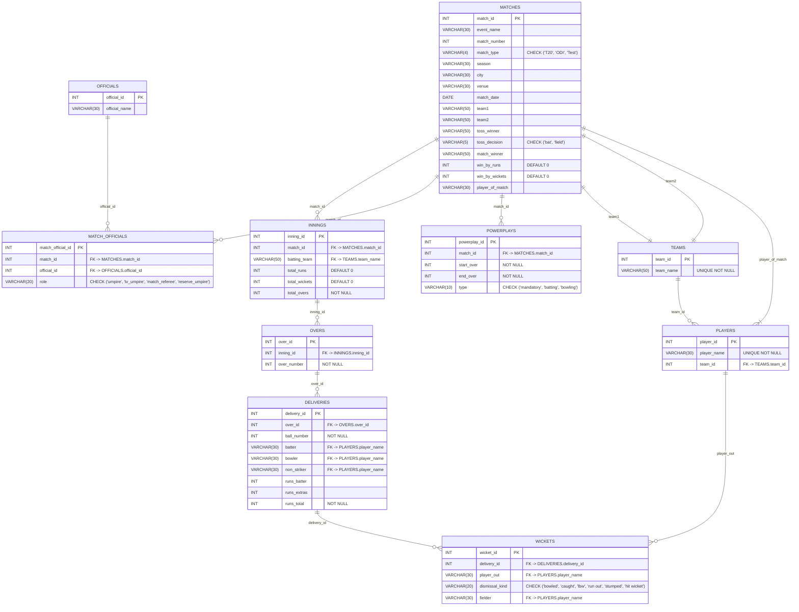

```mermaid
erDiagram
    MATCHES {
        INT match_id PK
        VARCHAR(30) event_name
        INT match_number
        VARCHAR(4) match_type "CHECK ('T20', 'ODI', 'Test')"
        VARCHAR(30) season
        VARCHAR(30) city
        VARCHAR(30) venue
        DATE match_date
        VARCHAR(50) team1
        VARCHAR(50) team2
        VARCHAR(50) toss_winner
        VARCHAR(5) toss_decision "CHECK ('bat', 'field')"
        VARCHAR(50) match_winner
        INT win_by_runs "DEFAULT 0"
        INT win_by_wickets "DEFAULT 0"
        VARCHAR(30) player_of_match
    }
    
    TEAMS {
        INT team_id PK
        VARCHAR(50) team_name "UNIQUE NOT NULL"
    }
    
    PLAYERS {
        INT player_id PK
        VARCHAR(30) player_name "UNIQUE NOT NULL"
        INT team_id "FK -> TEAMS.team_id"
    }
    
    OFFICIALS {
        INT official_id PK
        VARCHAR(30) official_name
    }
    
    MATCH_OFFICIALS {
        INT match_official_id PK
        INT match_id "FK -> MATCHES.match_id"
        INT official_id "FK -> OFFICIALS.official_id"
        VARCHAR(20) role "CHECK ('umpire', 'tv_umpire', 'match_referee', 'reserve_umpire')"
    }
    
    INNINGS {
        INT inning_id PK
        INT match_id "FK -> MATCHES.match_id"
        VARCHAR(50) batting_team "FK -> TEAMS.team_name"
        INT total_runs "DEFAULT 0"
        INT total_wickets "DEFAULT 0"
        INT total_overs "NOT NULL"
    }
    
    OVERS {
        INT over_id PK
        INT inning_id "FK -> INNINGS.inning_id"
        INT over_number "NOT NULL"
    }
    
    DELIVERIES {
        INT delivery_id PK
        INT over_id "FK -> OVERS.over_id"
        INT ball_number "NOT NULL"
        VARCHAR(30) batter "FK -> PLAYERS.player_name"
        VARCHAR(30) bowler "FK -> PLAYERS.player_name"
        VARCHAR(30) non_striker "FK -> PLAYERS.player_name"
        INT runs_batter
        INT runs_extras
        INT runs_total "NOT NULL"
    }
    
    WICKETS {
        INT wicket_id PK
        INT delivery_id "FK -> DELIVERIES.delivery_id"
        VARCHAR(30) player_out "FK -> PLAYERS.player_name"
        VARCHAR(20) dismissal_kind "CHECK ('bowled', 'caught', 'lbw', 'run out', 'stumped', 'hit wicket')"
        VARCHAR(30) fielder "FK -> PLAYERS.player_name"
    }
    
    POWERPLAYS {
        INT powerplay_id PK
        INT match_id "FK -> MATCHES.match_id"
        INT start_over "NOT NULL"
        INT end_over "NOT NULL"
        VARCHAR(10) type "CHECK ('mandatory', 'batting', 'bowling')"
    }
    
    MATCHES ||--o{ INNINGS : match_id
    MATCHES ||--o{ MATCH_OFFICIALS : match_id
    MATCHES ||--o{ POWERPLAYS : match_id
    MATCHES ||--|| TEAMS : team1
    MATCHES ||--|| TEAMS : team2
    MATCHES ||--|{ PLAYERS : player_of_match
    TEAMS ||--o{ PLAYERS : team_id
    INNINGS ||--o{ OVERS : inning_id
    OVERS ||--o{ DELIVERIES : over_id
    DELIVERIES ||--o{ WICKETS : delivery_id
    OFFICIALS ||--o{ MATCH_OFFICIALS : official_id
    PLAYERS ||--o{ WICKETS : player_out
```
