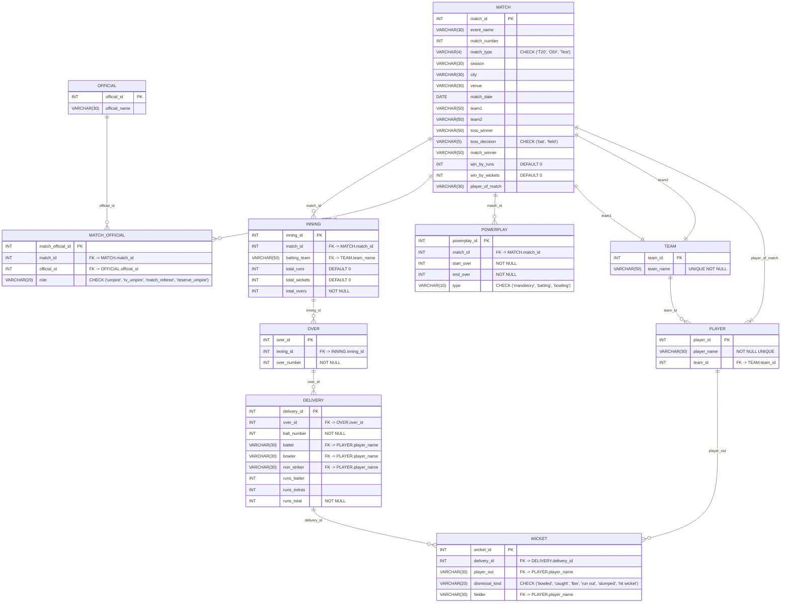

```mermaid
erDiagram
    MATCH {
        INT match_id PK
        VARCHAR(30) event_name
        INT match_number
        VARCHAR(4) match_type "CHECK ('T20', 'ODI', 'Test')"
        VARCHAR(30) season
        VARCHAR(30) city
        VARCHAR(30) venue
        DATE match_date
        VARCHAR(50) team1
        VARCHAR(50) team2
        VARCHAR(50) toss_winner
        VARCHAR(5) toss_decision "CHECK ('bat', 'field')"
        VARCHAR(50) match_winner
        INT win_by_runs "DEFAULT 0"
        INT win_by_wickets "DEFAULT 0"
        VARCHAR(30) player_of_match
    }

    TEAM {
        INT team_id PK
        VARCHAR(50) team_name "UNIQUE NOT NULL"
    }

    PLAYER {
        INT player_id PK
        VARCHAR(30) player_name "NOT NULL UNIQUE"
        INT team_id "FK -> TEAM.team_id"
    }

    OFFICIAL {
        INT official_id PK
        VARCHAR(30) official_name
    }

    MATCH_OFFICIAL {
        INT match_official_id PK
        INT match_id "FK -> MATCH.match_id"
        INT official_id "FK -> OFFICIAL.official_id"
        VARCHAR(20) role "CHECK ('umpire', 'tv_umpire', 'match_referee', 'reserve_umpire')"
    }

    INNING {
        INT inning_id PK
        INT match_id "FK -> MATCH.match_id"
        VARCHAR(50) batting_team "FK -> TEAM.team_name"
        INT total_runs "DEFAULT 0"
        INT total_wickets "DEFAULT 0"
        INT total_overs "NOT NULL"
    }

    OVER {
        INT over_id PK
        INT inning_id "FK -> INNING.inning_id"
        INT over_number "NOT NULL"
    }

    DELIVERY {
        INT delivery_id PK
        INT over_id "FK -> OVER.over_id"
        INT ball_number "NOT NULL"
        VARCHAR(30) batter "FK -> PLAYER.player_name"
        VARCHAR(30) bowler "FK -> PLAYER.player_name"
        VARCHAR(30) non_striker "FK -> PLAYER.player_name"
        INT runs_batter
        INT runs_extras
        INT runs_total "NOT NULL"
    }

    WICKET {
        INT wicket_id PK
        INT delivery_id "FK -> DELIVERY.delivery_id"
        VARCHAR(30) player_out "FK -> PLAYER.player_name"
        VARCHAR(20) dismissal_kind "CHECK ('bowled', 'caught', 'lbw', 'run out', 'stumped', 'hit wicket')"
        VARCHAR(30) fielder "FK -> PLAYER.player_name"
    }

    POWERPLAY {
        INT powerplay_id PK
        INT match_id "FK -> MATCH.match_id"
        INT start_over "NOT NULL"
        INT end_over "NOT NULL"
        VARCHAR(10) type "CHECK ('mandatory', 'batting', 'bowling')"
    }

    MATCH ||--o{ INNING : match_id
    MATCH ||--o{ MATCH_OFFICIAL : match_id
    MATCH ||--o{ POWERPLAY : match_id
    MATCH ||--|| TEAM : team1
    MATCH ||--|| TEAM : team2
    MATCH ||--|{ PLAYER : player_of_match
    TEAM ||--o{ PLAYER : team_id
    INNING ||--o{ OVER : inning_id
    OVER ||--o{ DELIVERY : over_id
    DELIVERY ||--o{ WICKET : delivery_id
    OFFICIAL ||--o{ MATCH_OFFICIAL : official_id
    PLAYER ||--o{ WICKET : player_out
```
